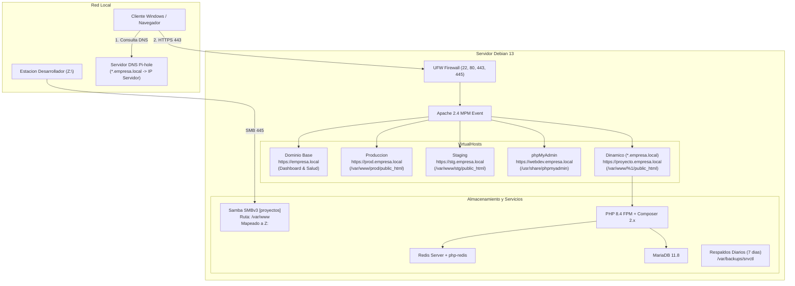
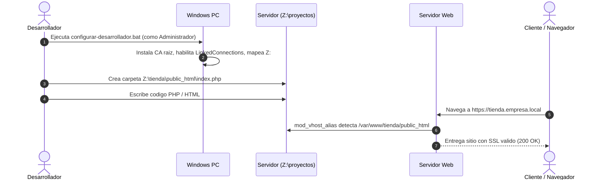

# Plataforma de Servidor Web srvctl — Debian 13

[](https://www.debian.org/)
[](https://httpd.apache.org/)
[](https://www.php.net/)
[](https://mariadb.org/)
[](https://redis.io/)
[](https://getcomposer.org/)
[](LICENSE)
[](https://github.com/ftole/svr_web_debian/actions/workflows/ci.yml)

**srvctl** es una plataforma de automatización y administración para servidores web nativos sobre **Debian 13 (Trixie)**. Transforma un equipo Debian recién instalado en un servidor de desarrollo y producción autosuficiente, modular, con paridad de características respecto a entornos profesionales (Hostinger), subdominios dinámicos sin configuración y resolución DNS simplificada mediante Pi-hole.

> [!CAUTION]
> Repositorio **propietario**. Todos los derechos reservados.
> Autor y titular: **José Francisco Toledo** (cisco_red@outlook.com) — consulte [`LICENSE`](LICENSE).

---

## Tabla de contenidos

1. [Vision general y caracteristicas](#vision-general-y-caracteristicas)
2. [Arquitectura del sistema](#arquitectura-del-sistema)
3. [Resolucion DNS con Pi-hole](#resolucion-dns-con-pi-hole)
4. [Requisitos previos](#requisitos-previos)
5. [Instalacion rapida](#instalacion-rapida)
6. [Flujo de trabajo para desarrolladores](#flujo-de-trabajo-para-desarrolladores)
7. [Flujo de configuracion para clientes](#flujo-de-configuracion-para-clientes)
8. [Uso de la herramienta srvctl](#uso-de-la-herramienta-srvctl)
9. [Seguridad y auditoria](#seguridad-y-auditoria)
10. [Estructura del proyecto](#estructura-del-proyecto)
11. [Verificacion y auto-diagnostico](#verificacion-y-auto-diagnostico)

---

## Vision general y caracteristicas

| Componente | Implementacion |
| :--- | :--- |
| **Sistema Operativo** | Debian GNU/Linux 13 (Trixie) x86_64 |
| **CLI de Gestion** | `srvctl` en `/usr/local/bin/srvctl` (consola y menu TUI interactivo) |
| **Servidor Web** | Apache 2.4 con MPM Event y `mod_vhost_alias` dinamico |
| **Motor PHP** | PHP 8.4 FPM (FastCGI) con extensiones web completas |
| **Gestor de Paquetes** | Composer 2.x binario global en `/usr/local/bin/composer` |
| **Cache y Memoria** | Redis Server local + extension PHP `php-redis` |
| **Base de Datos** | MariaDB 11.8 con acceso administrativo dual (`localhost` y `127.0.0.1`) |
| **Panel de BD** | phpMyAdmin 5.x sobre subdominio dedicado, sin advertencias de almacenamiento |
| **Dashboard de Salud** | Panel web en el dominio base (`https://empresa.local`) con telemetria en vivo |
| **Subdominios Dinamicos** | Creacion instantanea de proyectos en `/var/www/<proyecto>/public_html` |
| **Comparticion de Archivos**| Recurso unico Samba SMBv3 `[proyectos]` montado en `Z:\` |
| **Seguridad de Red** | UFW (puertos 22, 80, 443, 445, 3389) + Fail2ban |
| **Certificados TLS** | CA raiz interna + certificado comodin SAN (`*.empresa.local` + base + IP) |
| **Auditoria y Respaldo** | Registro de comandos en `/var/log/sudo.log` y respaldos rotativos de 7 dias |

---

## Arquitectura del sistema

El sistema desacopla la administracion en tres capas: resolucion de nombres delegada, ruteo web dinamico y almacenamiento compartido unificado.



---

## Resolucion DNS con Pi-hole

Para evitar tener que modificar el archivo `hosts` en cada equipo cada vez que se crea un subdominio, el entorno utiliza una regla comodin (wildcard) en su servidor **Pi-hole**. Debian no ejecuta ningun servidor DNS local adicional.

### Configuracion en 1 paso en Pi-hole:

1. Ingrese a la consola o SSH de su servidor Pi-hole.
2. Agregue una regla comodin en `/etc/dnsmasq.d/02-wildcard.conf`:
   ```bash
   address=/.empresa.local/10.1.0.4
   ```
   *(Sustituya `empresa.local` por su dominio base y `10.1.0.4` por la IP de su servidor Debian).*
3. Reinicie el servicio DNS de Pi-hole:
   ```bash
   pihole restartdns
   ```

A partir de este momento, cualquier peticion hacia `empresa.local`, `prod.empresa.local`, `tienda.empresa.local` o cualquier subdominio nuevo resolvera de forma automatica e instantanea a la IP del servidor.

---

## Requisitos previos

- Servidor con **Debian 13 (Trixie)** x86_64.
- Conectividad a Internet activa.
- Acceso con usuario `root` o usuario con privilegios `sudo`.
- Puertos libres: 22 (SSH), 80 (HTTP), 443 (HTTPS), 445 (Samba).

---

## Instalacion rapida

Ejecute el siguiente comando en la terminal de su servidor Debian:

```bash
curl -fsSL https://raw.githubusercontent.com/ftole/svr_web_debian/main/install.sh | sudo bash
```

El instalador:
1. Descargara la suite completa en `/opt/srvctl`.
2. Creara el binario de control global `/usr/local/bin/srvctl`.
3. Detectara los parametros de red de su equipo e iniciara el asistente guiado.
4. Desplegara todo el stack (Apache, PHP 8.4, Redis, MariaDB, phpMyAdmin, Samba, SSL comodin).
5. Depositara en el panel de bienvenida los instaladores automaticos para Windows.

### Modo desatendido (no interactivo):

Si desea automatizar el despliegue con variables predefinidas:

```bash
sudo ASISTENTE_NONINTERACTIVE=1 \
     SERVER_IP=10.1.0.4 \
     BASE_DOMAIN=empresa.local \
     ADMIN_USER=webadmin \
     ADMIN_PASS='ClaveSegura2026#' \
     bash /tmp/install.sh
```

---

## Flujo de trabajo para desarrolladores



### Pasos para el desarrollador:

1. **Configurar el equipo (1 sola vez):**
   - Abra el navegador e ingrese a `https://empresa.local`.
   - En la seccion de descargas, haga clic en `configurar-desarrollador.bat`.
   - Ejecute el archivo con clic derecho -> **Ejecutar como administrador**.
   - Esto instalara el certificado SSL de confianza, configurara el acceso SSH y montara la unidad **`Z:\`** conectada a `\\<IP>\proyectos`.

2. **Crear un nuevo proyecto (Cero configuracion):**
   - Abra el Explorador de Windows y entre en la unidad `Z:\`.
   - Cree una carpeta para su proyecto, por ejemplo: `Z:\tienda`.
   - Dentro de ella, cree la subcarpeta `public_html` y coloque su archivo `index.php`.
   - Listo. El proyecto esta inmediatamente disponible en:
     `https://tienda.empresa.local`
   - Sin tocar configuraciones de Apache, sin reiniciar servicios y con SSL valido.

---

## Flujo de configuracion para clientes

Para los usuarios que unicamente consultaran las aplicaciones web desde la red local:

1. Ingrese a `https://empresa.local`.
2. Descargue el archivo `configurar-cliente.bat`.
3. Ejecute con clic derecho -> **Ejecutar como administrador**.
4. El script importa la Autoridad Certificadora raiz (`rootCA.crt`) en el Almacen de Entidades de Certificacion de Confianza de Windows.
5. Los navegadores (Chrome, Edge, Firefox) reconoceran cualquier subdominio del servidor con candado verde sin advertencias de seguridad.

---

## Uso de la herramienta srvctl

El comando `srvctl` esta disponible globalmente en el sistema.

```bash
srvctl [comando] [argumentos]
```

### Comandos disponibles:

| Comando | Descripcion |
| :--- | :--- |
| `srvctl` | Inicia el menu grafico interactivo (TUI) con Whiptail |
| `srvctl status` | Muestra el estado operativo de los servicios del stack |
| `srvctl verify` | Ejecuta la suite de diagnostico profundo y auto-verificacion (40 comprobaciones) |
| `srvctl project create <nombre>` | Crea la estructura base para un nuevo proyecto (`public_html/index.php`) |
| `srvctl project list` | Lista los proyectos activos detectados en `/var/www` |
| `srvctl backup` | Ejecuta un respaldo manual inmediato de base de datos y archivos web |
| `srvctl reset` | Revierte el servidor al estado base limpio (rollback seguro) |
| `srvctl deploy` | Ejecuta el despliegue del stack completo |

---

## Seguridad y auditoria

- **UFW Firewall:** Politica de denegacion por defecto (`deny incoming`). Solo puertos estrictamente necesarios abiertos.
- **Fail2ban:** Proteccion contra ataques de fuerza bruta SSH activa con baneo automatico de IPs.
- **Auditoria Administrativa:** Toda ejecucion de comandos con privilegios elevados queda registrada con sello temporal en `/var/log/sudo.log`.
- **Restricciones de Samba:** Los archivos sensibles (`.git`, `.env`, `.htaccess`, llaves privadas `*.key` y el panel de control `_dashboard`) estan vetados de la red compartida (`veto files`).
- **Permisos SGID:** Las carpetas bajo `/var/www` mantienen el bit SGID (`2775`) y grupo `www-data` para evitar discrepancias de permisos entre Samba y Apache.

---

## Estructura del proyecto

```
/opt/srvctl/
├── bin/
│   └── srvctl                  # CLI ejecutable principal
├── core/
│   ├── config.sh               # Gestion de configuracion persistente
│   ├── logger.sh               # Sistema de logs y consola
│   └── validator.sh            # Validadores de red, dominios y seguridad
├── modules/
│   ├── backup/snapshot.sh      # Respaldos diarios por hard-links
│   ├── security/firewall.sh    # Reglas UFW y Fail2ban
│   ├── security/ssh.sh         # Hardening SSH y auditoria sudo
│   ├── share/samba.sh          # Servidor Samba SMBv3 [proyectos]
│   ├── stack/base.sh           # Utilidades y paquetes base
│   ├── stack/mariadb.sh        # MariaDB 11.8 y securizacion
│   ├── stack/php.sh            # PHP 8.4 FPM y Composer 2.x
│   ├── stack/phpmyadmin.sh     # phpMyAdmin 5.x y storage pmadb
│   ├── stack/redis.sh          # Redis Server y extension php-redis
│   ├── system/network.sh       # Optimizacion de red (desactivar IPv6)
│   ├── system/power.sh         # Politicas anti-suspension systemd
│   ├── web/apache.sh           # VirtualHosts y ruteo mod_vhost_alias
│   ├── web/dashboard.sh        # Panel de salud y recursos descargables
│   └── web/ssl.sh              # Autoridad CA raiz y certificado comodin
├── templates/
│   ├── dashboard/              # Codigo fuente del panel de salud
│   └── windows/                # Scripts batch .bat de aprovisionamiento
└── tests/
    └── test_validator.sh       # Suite de pruebas unitarias y chaos testing
```

---

## Verificacion y auto-diagnostico

Para comprobar la integridad del stack en cualquier momento:

```bash
sudo srvctl verify
```

La suite valida:
- Servicios activos en systemd (Apache, PHP-FPM, MariaDB, Redis, Samba, UFW, Fail2ban).
- Respuesta HTTP 200 en el dominio base (Dashboard) y subdominios.
- Correcta ejecucion de PHP 8.4 y conectividad con Redis.
- Login real a phpMyAdmin contra la base de datos sin advertencias.
- Permisos del recurso compartido Samba `[proyectos]`.
- Integridad de certificados SSL comodin.
- Estado del sistema de respaldos.

---

## Licencia

Este software es propiedad exclusiva de **José Francisco Toledo**. Todos los derechos reservados.
Consulte el archivo [`LICENSE`](LICENSE) para los terminos de licenciamiento.
